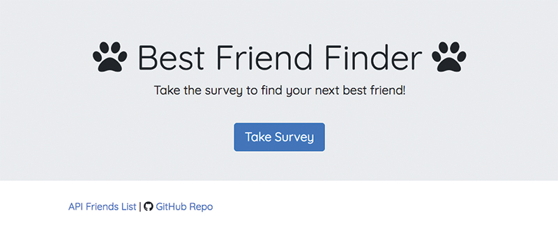
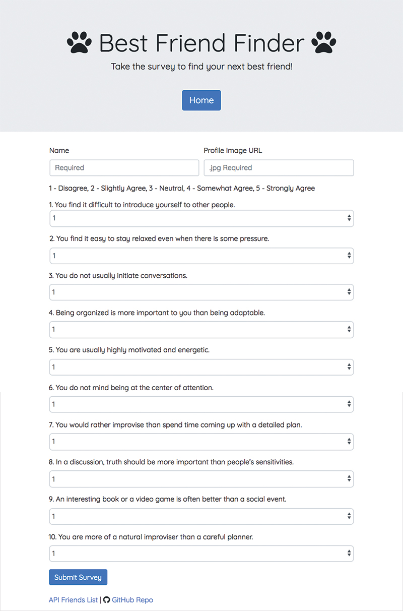
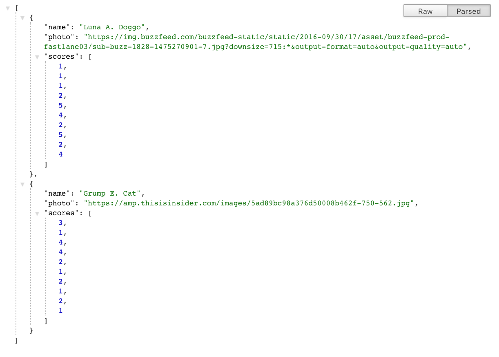

# Friend-Finder

"FriendFinder" is a compatibility-based application -- basically a dating app. This full-stack site will take in results from your users' surveys, then compare their answers with those from other users. The app will then display the name and picture of the user with the best overall match. It uses Express to handle routing. The app is deployed to Heroku so other users can fill it out.

## Apps ##

**Best Friend Finder**

=============================================================

=============================================================

[View Full Project](https://bestfriend-finder36.herokuapp.com/)

## Tools ##

**Technology Used**
* Node.js
* Javascript
* Express.js
* Heroku
* POSTman
